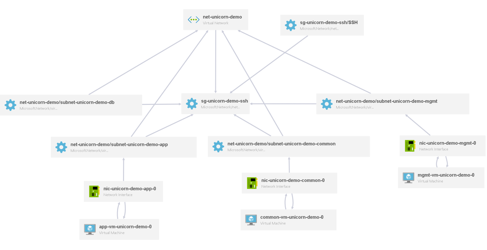
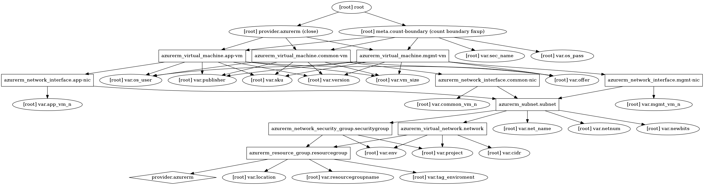

DEMO Azure enviroment
=====


Infrastructure code for Terraforming in Azure cloud
-----

Version 0.4
- Added availibility set for App
- Azure docker extension added

Version 0.3
- Addec custom_data to install salt-minion

Version 0.2
- Added APP http loadbalancer
- Added Public IP for management host

Version 0.1
- First tested version

***

## Code - structure

```
unicorn
    infra-azure
      |— resourcegroup.tf
      |— network.tf
      |— loadbalancer.tf
      |— output.tf
      |— security.tf
      |— variables.tf
      |— vm-app.tf
      |— vm-common.tf
      |— vm-mgmt.tf

```

## Components

### Network
Build a network stack

### Loadbalancer
Create HTTP Loadbalancer for APP

### Security groups
Create security group.

### VM Mgmt
Create VM in MGMT subnet, which server as jump/access control host

### VM App-Stack
Create VMs in APP subnet

### VM Common
Create VMs in Common subnet

## Variables

### Provider
- `subscription_id`
- `client_id`
- `client_secret`
- `tenant_id`

Here you can define you subscription details to which infrastructure will be provisioned.

Use principal accout to provision Infrastructure in Azure: (https://docs.microsoft.com/en-us/cli/azure/create-an-azure-service-principal-azure-cli?view=azure-cli-latest)

Generate principal account:
```
 az ad sp create-for-rbac --role="Contributor" --scopes="/subscriptions/${SUBSCRIPTION_ID}"
```

### Projekt a prostredie
- `project` - default: unicorn
- `env` - default: demo
  `resourcegroupname` - default: unicornDemoEnv
  `location` - default: West Europe
  `tag_enviroment` - default: Unicorn Demo

This are variables which serve as identification or tags for project. They are used to generate names of subnets and VMs.
Here you can define also geolocation and resourcegroup name

### Network setup
- `net_name` - default: mgmt, app, common
- `cidr` - default: 100.10.0.0/16
- `newbits` - default: 8
- `netnum` - default: 0

### VM Global setup
- `publisher` - default: CentOS-7-x86_64
- `offer` - default: UbuntuServer
- `sku` - default: 16.04.0-LTS
- `version` - default: latest
- `vm_size` - default: Standard_D1_v2

This are global settings for all provisioned VMs

### Mgmt VM setup
- `mgmt_vm_n` - default: 1

### App VM setup
- `app_vm_n` - default: 1

### Common VM setup
- `common_vm_n` - default: 1


